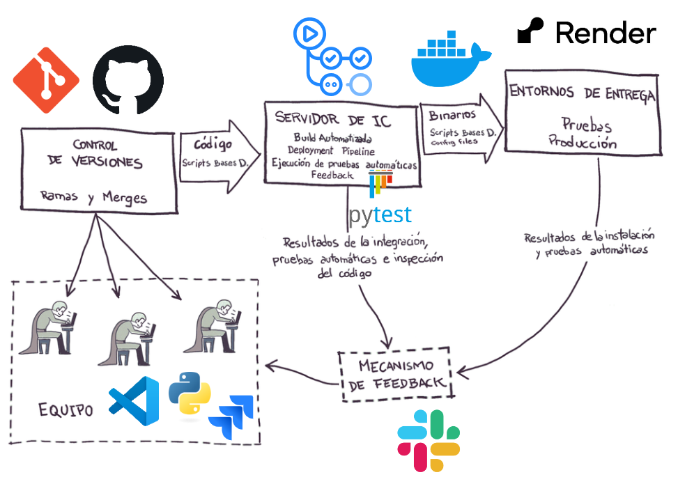

# Calculadora con Flask

## Descripción
Pequeño proyecto que implementa un pipeline de Integración Continua (CI).

## Ejecución local

### 1. Clonar y preparar entorno
```bash
git clone https://github.com/IanNunez21/TallerIC2025.git
cd TallerIC2025
python -m venv env
# Windows:
env\Scripts\activate
# macOS/Linux:
source env/bin/activate
pip install --upgrade pip
pip install -r requirements.txt
```

### 2. Ejecutar pruebas
```bash
python -m pytest
```

### 3. Levantar la aplicación sin Docker
Dirigirse a la carpeta donde se encuentra el archivo app.py y ejecutar:
```bash
flask run
```

### 4. (Opcional) Usar Docker localmente
```bash
docker build -t calculadora-web:local .
docker run -p 8080:8080 calculadora-web:local
``` 

## Pipeline CI en GitHub Actions
El archivo (`.github/workflows/ci.yml`) define los siguientes jobs:

1. **build**: instala dependencias y corre `pytest`.
2. **containerization**: construye la imagen Docker y la sube a Docker Hub.
3. **deploy_render**: invoca un webhook para desplegar en Render.
4. **notify-slack-deploy-success** / **notify-slack-on-failure**: envían notificaciones a Slack.

## Despliegue en Render
1. Subir la imagen a Docker Hub: `docker push tu_usuario/calculadora-web:latest`.
2. En Render, crear un **Web Service** → **Existing Image** → `docker.io/tu_usuario/calculadora-web:latest`.
3. Si la imagen es privada, configurar credenciales (`DOCKER_USERNAME` y `DOCKER_PASSWORD`).
4. Usar el webhook (`RENDER_DEPLOY_HOOK_URL`) desde GitHub Actions.


